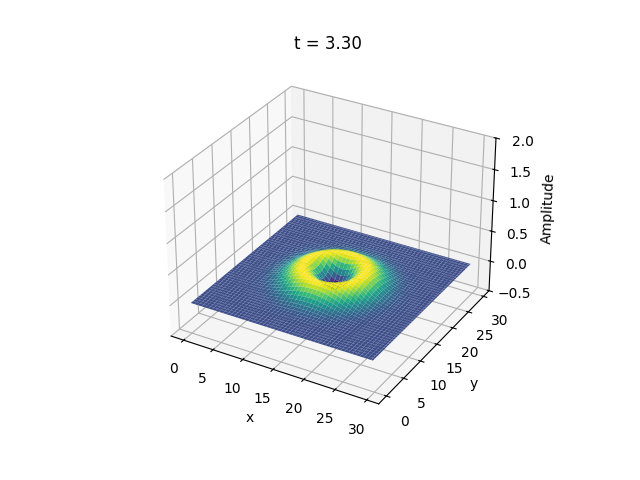

# 2+1 wave plotting

## Quick links
**_TUTUORIAL_** (youtube unlisted link): [HOW TO RUN THE 2+1 WAVE VISUALISATION PROJECT](https://youtu.be/PGadxW2j_VQ)

**_TO TEST THE CODE, ACCESS THIS_**: [GOOGLE COLAB CODE](https://colab.research.google.com/drive/1QVAfFcDTj8onUciqTtq9gnGhLE3H-X_j?usp=sharing)

# Documentation

## _Table of Contents_
- [1) Introduction](#1-introduction)
  - [Why Google Colab?](#why-google-colab)
  - [Objectives and purpose](#objectives-and-purpose) 
- [2) In-depth analysis](#2-in-depth-analysis)
  - [The wave equation](#the-wave-equation)
  - [Mathematical basis](#mathematical-basis)
- [3) Implementation](#3-implementation)
  - [Code explanations](#code-explanations)
- [4) Plots examples](#4-plots-examples)
- [5) Future improvements](#5-future-improvements)
- [6) Conclusion](#6-conclusion)

## 1) Introduction
This project models and visualizes the propagation of a wave in flat spacetime with zero shift. The implementation uses the fourth-order Runge-Kutta (RK4) method to solve the governing equations numerically.

### _Why Google Colab?_
Google Colab (short for Colaboratory) is a cloud-based platform provided by Google that allows users to write, execute, and share Python code in a web-based environment. It is particularly well-suited for tasks involving data analysis, machine learning, and scientific computing, as it provides free access to computational resources such as GPUs and TPUs.

Google Colab eliminates the need for extensive local setup by enabling code execution directly in the cloud. This means that users do not need to install Python or additional libraries on their local machines, as all dependencies can be specified and installed within the Colab notebook. Furthermore, Colab notebooks are easily shareable via links, making collaboration and distribution of code straightforward.

In the context of this project, I chose Google Colab because it ensures that my wave plotting code can be accessed and run seamlessly anywhere, anytime by anyone, without requiring any configuration of the project on local machines. By hosting the code on Colab, I can provide a ready-to-run environment where the project can be executed interactively, enhancing both accessibility and user experience.

### _Objectives and purpose_
The purpose of this project is to simply visualise some waves in the 2+1 dimension (2 for space, 1 for time). 

Some of my personal objectives of this project are: 
- the code to be easily readable 
- the changes in the code to be done quickly 
- to be portable and accessible for anyone, on any device
- to learn new things

## 2) In-depth analysis

In this project, we study the evolution of a scalar wave in a 2D spatial domain with time, governed by the wave equation in flat spacetime: <br>
$\frac{\partial^2\phi}{\partial t^2}=c^2 \nabla^2 \phi$ <br>

where: 
- $\phi(x, y, t)$ is the wave amplitude, where $(x, y)$ are space coordinates and $t$ is the time coordinate
- $c$ is the speed of wave propagation
- $\nabla^2$ is the Laplacian operator in 2 spacial dimensions

We use the fourth-order *Runge-Kutta method (RK4)* to integrate the equation in time, ensuring numerical stability and high accuracy. The solution is visualised as a time-dependent 3D plot. 


### _The wave equation_
The wave equation in flat spacetime is derived from the conservation of energy and momentum. In 2+1 dimensions (two spatial dimensions, one temporal), it takes the form: <br>

$\frac{\partial^2\phi}{\partial t^2}=c^2(\frac{\partial^2\phi}{\partial x^2}+\frac{\partial^2\phi}{\partial y^2})$ <br>


### _Mathematical basis_
The wave amplitude $\phi(x, y, t)$ is stored in a 3D array, known in the code as ```phi```: 
- $\phi[:, :, 0]:t - \triangle t$ is the previous timestep 
- $\phi[:, :, 0]:t$ is the current timestep
- $\phi[:, :, 0]:t + \triangle t$ is the next timestep 

The Laplacian is calculated using central finite differences. 

The wave starts as a Gaussian Pulse centred in ```(x_start, y_start)``` with a specified width. 

### _Runge-Kutta for time integration_
For time integration, we can switch to Runge-Kutta (RK4) for time evolution. It means replacing the finite difference time integration with the RK4 scheme: 

1. We compute:
   - $k_1=S(t^n, \phi^n)$
   - $k_2=S(t^n + \frac{\triangle t}{2}, \phi^n + \frac{\triangle t}{2}k_1)$
   - $k_3=S(t^n + \frac{\triangle t}{2}, \phi^n + \frac{\triangle t}{2}k_2)$
   - $k_4=S(t^n + \triangle t, \phi^n + \triangle t k_3)$
2. We update $\phi^{n+1} = \phi^n + \frac{\triangle t}{6}(k_1 + 2k_2 + 2k_3 + k_4)$

## 3) Implementation

In the beginning, we will set a Gaussian Pulse centered in ```(x_start, y_start)```: $\phi(x, y, t = 0) = exp(-\frac{(x-x_{start})^2+(y-y_{start})^2}{\sigma^2})$ <br> 
<br>
where $\sigma$ is the Gaussian wave width.

The initial velocity is simply set to zero: $\psi(x, y, t = 0) =0$

### _Code explanations_
For the libraries, we have used 2 big libraries for data processing: 
- **NumPy** - used for efficient numerical operations such as generating arrays and performing mathematical functions 
- **Matplotlib** - used for creating static, animated and interactive plots

## 4) Plots examples
Here are some plots snapshots: 



## 5) Future improvements
- Higher dimensions - extending the model to 3+1 dimensions for more realistic physics
- Optimisation - for using GPU computing for larger grids and faster computations

## 6) Conclusion
By combining the finite difference method for spatial discretization with the Runge-Kutta 4th-order method for time integration, the implementation achieves accurate and stable results. The visualised Gaussian wave demonstrates symmetric propagation, validating the numerical approach. This work provides a solid foundation for exploring more complex wave dynamics and can be extended to higher dimensions or advanced boundary conditions in the future studies.